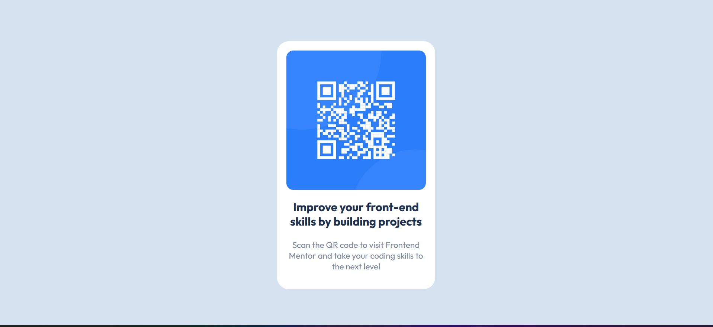

# Frontend Mentor - QR code component solution

This is a solution to the [QR code component challenge on Frontend Mentor](https://www.frontendmentor.io/challenges/qr-code-component-iux_sIO_H). Frontend Mentor challenges help you improve your coding skills by building realistic projects. 

## Table of contents

- [Overview](#overview)
  - [Screenshot](#screenshot)
  - [Links](#links)
- [My process](#my-process)
  - [Built with](#built-with)
  - [What I learned](#what-i-learned)
- [Author](#author)

**Note: Delete this note and update the table of contents based on what sections you keep.**

## Overview
Styling a qr-code card

### Screenshot


### Links

- Solution URL: [Add solution URL here](https://github.com/ofaruqayo/html-css-qrcode)
- Live Site URL: [Add live site URL here](https://ofaruqayo.github.io/html-css-qrcode/)

## My process
I started by creating the structure of the entire document using HTML5
I proceeded by styling the HTML document using internal CSS 
### Built with

- Semantic HTML5 markup
- CSS custom properties
- Flexbox

### What I learned
This is a simple webpage which improved my knowledge of using flexbox and media queries
Use this section to recap over some of your major learnings while working through this project. Writing these out and providing code samples of areas you want to highlight is a great way to reinforce your own knowledge.

To see how you can add code snippets, see below:

```html
<h1>Some HTML code I'm proud of</h1>
```
```css
    @media (max-width: 375px) {
      .container {
        width: 87%;
      }

      h1 {
        font-size: 23px;
      }

      p {
        font-size: 17px;
      }
    }
```

## Author

- Website - [Faruq Ayomide](https://www.your-site.com)
- Frontend Mentor - [@yourusername](https://www.frontendmentor.io/profile/yourusername)
- Twitter - [@faruqayomide](https://x.com/iamfaruqayomide?s=11)
